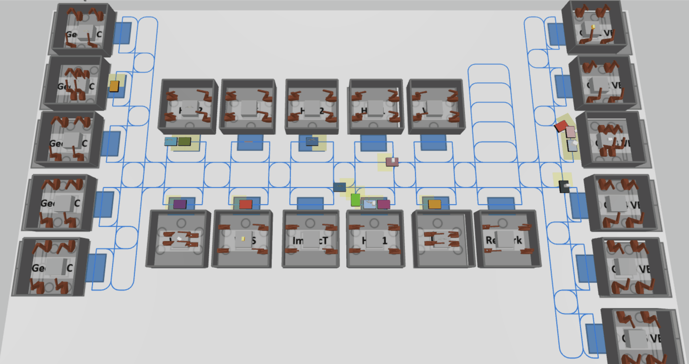

# Thesis

Master Thesis on Reinforcement Learning with Anylogic

## Installation

For the Python part, just run 'pip install -r requirements.txt'. 

There's a tiny bug to RLLIB 2.1.0 which we will have to fix. in ~ray/rllib/policy/sample_batch.py on line 942 we will find:

    data = tree.map_structure(lambda value: value[start:stop], self)

which we will have to change to :

    data = tree.map_structure(lambda value: value[int(start):int(stop)], self)

You can get Anylogic from their [website](https://www.anylogic.com/downloads/). Any version works, but there are limitations to some versions as stated in the [Alpyne docs](https://t-wolfeadam.github.io/Alpyne/_build/html/intro_getstarted.html).

JRE is also required, CUDA might be useful.

If you plan to work with certain libraries in Anylogic (like Material Handling), be aware that depending on the Anylogic version you might be required to move some .jar files. The procedure is described in the corresponding [issue on github](https://github.com/t-wolfeadam/Alpyne/issues/18).

## Structure

- [envs](./envs): Anylogic-models and exported .zips for training
- [exploration](./exploration): Collection of jupyter notebooks for running examples and training procedures 
    - [demos](./exploration/demos/):
        - [agv_slipcourse_stable_baselines](./exploration/basics_re/agv_slipcourse_stable_baslines.ipynb): Simple example of a PPO-learning-agent (from stable basleines 3) in the environment from the [Anylogic Reinforcement Learning Tutorial](https://www.youtube.com/watch?v=NeQYsKADD_c) being trained with alpyne.
    - [training](./exploration/training/): Different training notebooks for the MiniMatrix- & Matrix-Environment. *These notebooks initialize with an absolute path for multiple runners, which you will have to change*
        - [training_rout](./exploration/training/training_rout.ipynb): Train the routing Agent.
        - [training_disp](./exploration/training/training_disp.ipynb): Train the dispatching Agent.
        - [training_disp_rout](./exploration/training/training_disp_rout.ipynb): Train both dispatching and douting at once.
        - [tests](./exploration/training/tests.ipynb): Notebook with some tools for debugging and evaluation.
        - [evaluation](./exploration/training/evaluation.ipynb): Notebook with some useful tools to analyze and plot the log files. Here, some the images from the thesis were created.
- [thesis](./thesis): Everything that is referenced from the notebooks in [exploration](./exploration).
    - [envs](./thesis/envs): Gym-Environments for RL Training
        - [agv_slipcourse](./thesis/envs/agv_slipcourse.py): Simple example for a single agent environment with Alpyne and Gym.
        - [base_alpyne_zoo](./thesis/envs/base_alpyne_zoo.py): PettingZoo-compatible base class for multi agent environments with Alpyne. Behaviors of agents can be implemented seperately and switched easily.
        - [matrix](./thesis/envs/matrix.py): PettinZoo-Env for Matrix and MinimMatrix-Simulations. 
        - [behaviors](./thesis/envs/behaviors.py): All agent behaviors for the thesis, including collisionfree pathfinding, random dispatching and learnable agents. 
        - [part_variants](./thesis/envs/part_variants.py): Some simple classes do represent product variants and applicable stations.
    - [policies](./thesis/policies/): Deep-learning-models for RL-training. See thesis for details. 
    - [pypeline_connectors](./thesis/pypeline_connectors/): Code used for running trained policies from AnyLogic with visualization
    - [utils](./thesis/utils/): Some useful tools